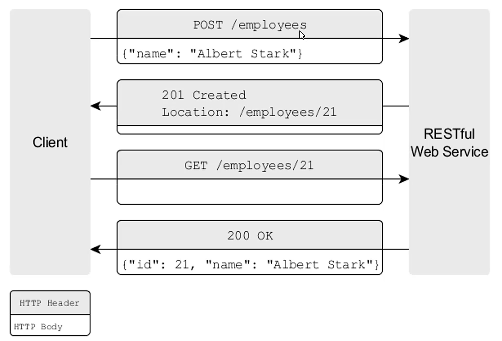

# gRPC快速入门 

## 1 进程间通信的演化过程

### 1.1 进程间通信

进程间通信，通常是指一个应用实例调用另外一个应用实例所提供的服务，而这两个应用都运行在自己独立的进程中，通过网络彼此交换信息的过程。

### 1.2 进程间通信的主要技术

- <u>传统的RPC技术</u>：Java远程方法调用(RMI)，基于TCP通信实现远程调用，实现**逻辑非常复杂**，且只能规定在**Java应用之间**实现远程通信。
- <u>SOAP协议</u>：简单对象访问协议，通过**HTTP协议**， 上封装**XML格式的SOAP数据包**，实现跨进程通信，是早期***WebService技术***的底层实现，**消息格式的复杂性**与以及围绕S0AP所构建的各种规范的复杂性，妨碍了构建分布式应用程序的敏捷性，逐渐被**REST架构风格**的应用程序所替代。

### 1.3 RESTful架构风格

**<u>*RESTful*</u>**的通用实现是HTTP，通过HTTP，可以将RESTful Web 应用程序建模为能够通过URI的资源集合。应用于资源的状态变更操作会采用HTTP动词(GET、 POST、 PUT、DELETE等) 的形式，资源的状态会以文本的格式来表述，如JSON、 XML等。

<u>RESTful架构风格的问题</u>：

- 基于**文本**的低效消息协议（HTTP）

- 应用程序之间缺乏**强类型接口**

  - 标准的RPC方案：使用**存根类**屏蔽网络传输中的复杂性与具体细节，可以实现像调用本地方法那样调用远程服务

    

    > 使用**存根类**，编译时就可以检查调用方式是否正确

  - RESTful：必须了解服务方的很多细节

    

    > 没有存根类，只有运行通信时才能进行格式测试

- RESTful架构风格难以**强制实施**

  - HTTP是**无状态**的，RESTful也是**弱约束**的
  - 难以形成统一的标准与约束，不利于大规模合作

  > Swagger UI这类**文档**工具并不能从根本上解决这个问题

  > 享受了RESTful的灵活性，也受制于RESTful的灵活性；
  >
  > RESTful并不落后，目前也是很多分布式架构的底层实现

## 2 初识Google gRPC框架

> 新一代gRPC通信框架

### 2.1 gRPC的发展

长期以来，谷歌有一个名为Stubby的通用RPC框架，用来连接成千上万的微服务，Stubby有许多很棒的特性，但无法标准化为业界通用的框架，这是因为它与谷歌内部的基础设施耦合得过于紧密。

2015年，谷歌发布了开源RPC框架gRPC，这个RPC基础设施具有标准化、可通用和跨平台的特点，旨在提供类似Stubby的可扩展性、性能和功能，但它主要面向社区。

### 2.2 gRPC的优势与劣势

<u>gRPC的优势</u>：

- 提供**高效**的进程间通信

  > 没有采用文本化格式，而是使用`protobuf`的二进制协议，在HTTP2.0基础上实现的

- 具有简单且定义良好的**服务接口和模式**

  > **契约优先**：根据标准化的定义文件生成彼此的代码

- 属于**强类型调用**

- 支持**多语言**

  > 可以通过简单的命令生成不同语言的代码

- 支持**双工通信**

  > 客户端与服务端都可以主动向对方发起通信，即时交流

- 大厂背书社区活跃

<u>gRPC的劣势</u>：

- gRPC不太适合面向**外部**的服务

  > 一般不能强制要求外部的客户使用某种方式接入服务，而是要向客户方妥协

- 巨大的服务定义变更是复杂的开发流程

  > 契约代码一旦大规模更新，很多开发方都要修改

- gRPC生态系统相对较小

### 2.3 gRPC传输格式protobuf

protobuf (Google Protocol Buffers) 是Google提供一个具有高效的协议**数据交换格式工具库**（类似Json），Protobuf有更高的转化效率，时间效率和空间效率都是JSON的3 -5倍。

## 3 安装Protobuf环境与Idea插件

> https://github.com/protocolbuffers/protobuf/releases
>
> 下载win64.zip，解压

环境变量：

- 配置`%PROTOCBUF_HOME%`
- 将`%PROTOCBUF_HOME%\bin`加入`PATH`

IDEA插件：Protobuf

## 4 实战案例：News服务端

[实战案例：News服务端](实战案例：News服务端/README.md)

## 5 实战案例：News客户端

[实战案例：News客户端](实战案例：News客户端/README.md)