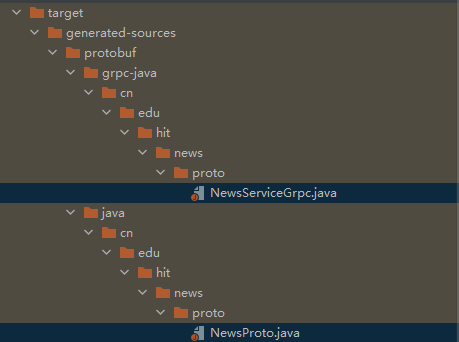
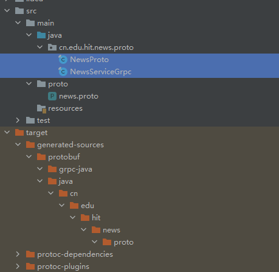

# 实战案例：News服务端

> 使用Maven

1. Maven增加gRPC依赖坐标系

   ```xml
   <dependencies>
     <dependency>
       <groupId>io.grpc</groupId>
       <artifactId>grpc-netty-shaded</artifactId>
       <version>1.47.0</version>
     </dependency>
     <dependency>
       <groupId>io.grpc</groupId>
       <artifactId>grpc-protobuf</artifactId>
       <version>1.47.0</version>
     </dependency>
     <dependency>
       <groupId>io.grpc</groupId>
       <artifactId>grpc-stub</artifactId>
       <version>1.47.0</version>
     </dependency>
     <dependency>
       <groupId>org.apache.tomcat</groupId>
       <artifactId>annotations-api</artifactId>
       <version>6.0.53</version>
       <scope>provided</scope>
     </dependency>
   </dependencies>
   ```

2. 引入protobuf-maven-plugin插件

   ```xml
    <build>
           <extensions>
               <extension>
                   <groupId>kr.motd.maven</groupId>
                   <artifactId>os-maven-plugin</artifactId>
                   <version>1.6.2</version>
               </extension>
           </extensions>
           <plugins>
               <plugin>
                   <groupId>org.xolstice.maven.plugins</groupId>
                   <artifactId>protobuf-maven-plugin</artifactId>
                   <version>0.6.1</version>
                   <configuration>
                       <protocArtifact>com.google.protobuf:protoc:3.17.3:exe:${os.detected.classifier}</protocArtifact>
                       <pluginId>grpc-java</pluginId>
                       <pluginArtifact>io.grpc:protoc-gen-grpc-java:1.42.0:exe:${os.detected.classifier}</pluginArtifact>
                   </configuration>
                   <executions>
                       <execution>
                           <goals>
                               <goal>compile</goal>
                               <goal>compile-custom</goal>
                           </goals>
                       </execution>
                   </executions>
               </plugin>
           </plugins>
       </build>
   ```

3. 编写proto服务定义文件

   - 在main文件夹下创建**proto文件夹**，编写扩展名为`.proto`的文件

     ```protobuf
     // 使用proto3语法
     syntax = 'proto3';
     // 是否生成多个类（false代表存根只生成一个大类，其他的都用内部类）
     option java_multiple_files = false;
     // 生成java存根类所在的包
     option java_package = 'cn.edu.hit.news.proto';
     // 生成外层类类名（生成存根的大类的类名）
     option java_outer_classname = 'NewsProto';
     // proto文件逻辑上的包名
     package news;
     // 定义RPC服务RouteGuide
     service NewsService {
       // list是方法名，NewsRequest代表传入参数（对应一个Java类），NewsResponse代表返回响应（对应一个Java类）
       rpc list(NewsRequest) returns (NewsResponse) {}
     }
     message NewsRequest {
       // 这里的`= 1`不是赋值，而是给属性的编号，会被grpc解析处理，要求在message中是唯一的
       string date = 1; 
     }
     message NewsResponse {
       //repeated说明是一个集合，集合中每一个元素都是News对象
       repeated News news = 1;
     }
     // News新闻实体对象
     message News {
       int32 id = 1; // Java中的int
       string title = 2;
       string content = 3;
       int64 createTime = 4; // Java中的long
     }
     ```

   - 用protobuf插件的compile命令生成**存根类**、compile-custom命令生成**grpc通信类**

   - 将生成的类移动的java包下

     

     

4. 实现服务端业务逻辑

   - 继承grpc通信类的一个实现类，重写之前规定的方法，实现业务逻辑

   - grpc为了实现双工通信，使用了一个观察者对象去观察返回值，这个对象会放在业务方法的最后一个参数上

     > 要使用这个对象的`onNext`方法传递返回值

   - 方法参数类型都有`getter`和`setter`；集合类型对应的方法会多传入一些必要的参数，同时也增加了`addXxx`和`removeXxx`方法

   - grpc对象的创建一般都使用**构造器模式**

   - 处理完业务要调用`responseObserver.onCompleted()`

   ```java
   public class NewsService extends NewsServiceGrpc.NewsServiceImplBase {
       @Override
       public void list(NewsProto.NewsRequest request, StreamObserver<NewsProto.NewsResponse> responseObserver) {
           String date = request.getDate();
           NewsProto.NewsResponse newList = null;
           try {
               NewsProto.NewsResponse.Builder newListBuilder = NewsProto.NewsResponse.newBuilder();
               for (int i = 0; i < 100; i++) {
                   NewsProto.News news = NewsProto.News.newBuilder()
                           .setId(i)
                           .setContent(date + "当日新闻内容" + i)
                           .setTitle("新闻标题" + i)
                           .setCreateTime(new Date().getTime())
                           .build();
                   newListBuilder.addNews(news);
               }
               newList = newListBuilder.build();
           } catch (Exception e) {
               responseObserver.onError(e);
           } finally {
               responseObserver.onNext(newList);
           }
           responseObserver.onCompleted();
       }
   }
   ```

5. 开发服务端启动器

   - GRPC底层基于Netty，需要占用端口
   - 要将写好的业务Service对象传给Server去管理

   ```java
   public class GrpcServer {
       private static final int port = 9999;
       public static void main(String[] args) throws InterruptedException, IOException {
           Server server = ServerBuilder.forPort(port).addService(new NewsService()).build().start();
           System.out.println("GRPC服务端启动成功，端口号：" + port);
           server.awaitTermination();
       }
   }
   ```

   

