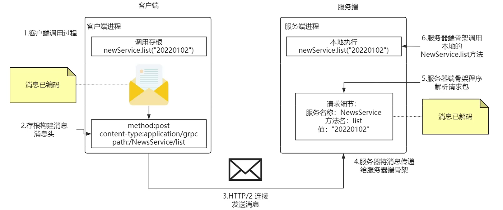
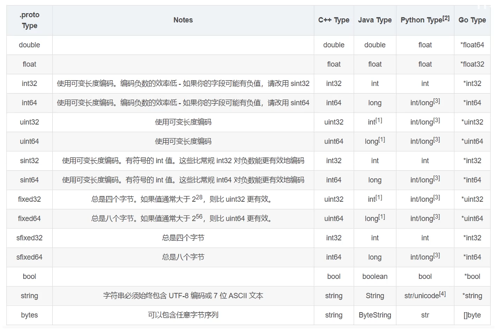
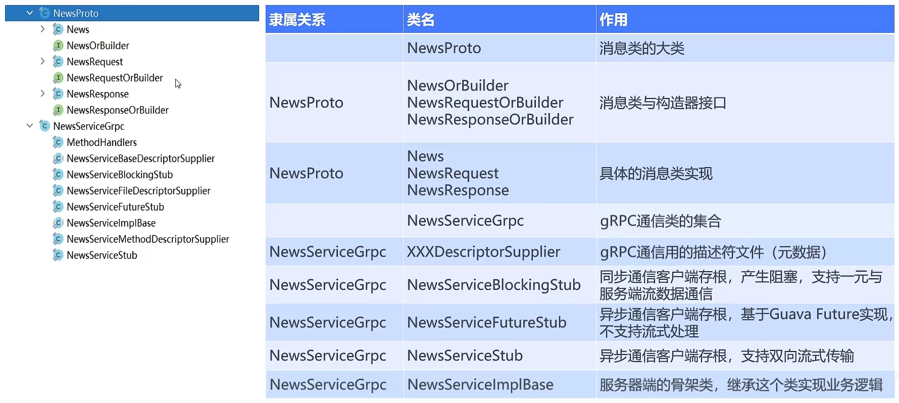

# gRPC通信原理

## 1 gRPC通信的底层原理

### 1.1 执行流程解析

> 以练手项目news为例进行讲解

- **消息头**

  - `method`都是`post`
  - `application.grpc`是gRPC特有的`content-type`
  - `path`指明了要调用的服务和方法

- 和大部分RPC调用处理过程类似，但gRPC底层使用了可移植性和可扩展性更强的protobuf

  > 具体的体现就是客户端与服务商持有相同的proto文件

## 2 ProtoBuf语法讲解

`syntax`：目前都使用`proto3`

`option`：选项部分，指明生成代码时的一些细节

`package`：逻辑包名，用于区分不同的`service`和`message`

- 如果在proto文件中使用到了其他包的`message`，可以用`包名.消息名`来指定

`service`：用于描述要生成的**API接口**，类似Java的业务逻辑接口类

- `rpc`方法：`rpc 方法名(参数类型列表) returns (返回值类型) {}`

`message`：gRPC**描述信息的基本单位**，类似Java的“实体类”

- 消息的名字对应于生成代码后的**类名**

- 每一个消息都对应生成一个类，根据`java_multiple_files`的设置，生成不同的文件数量

  - `java_multiple_files=true`，`protobuf`为每一个消息自动生成一个java文件
  - `java_multiple_files=false`，`protobuf`为会生成一个大类，消息作为子类集中在一个java文件

- 字段：`类型 名称 = 索引值（id）` 

  - 每个字段都要定义唯一的**索引值**，这些数字是用来在消息的二进制格式中识别各个字段的，一旦开始使用就不能够再改变

    > **标识号范围**：$[1,2^{29}-1]$和$536870911$；
    >
    > 不可以使用$[19000,19999]$这些标识号，protobuf对其进行了预留；
    >
    > Tips：如果未来有可能增加一些字段，并且顺序上要插入到之前的字段中，不要去修改之前字段的id，最好在最开始就预留一些id空间，比如设置成10、20、30、...

  - 数据类型的对照关系如下：

    

  - 如果需要**集合**类型字段，就要在**原类型**前加`repeated`关键字

    - 会生成对应的方法：`getXxxList()`

> 还有`stream`流式处理，之后会介绍

## 3 生成代码解析

> 以练手项目news为例进行讲解

大类：

- 构造器类
- 消息类
- gRPC通信类
  - 服务端骨架类（ImplBase）
  - 客户端存根类（Stub）
    - 阻塞
    - 异步

