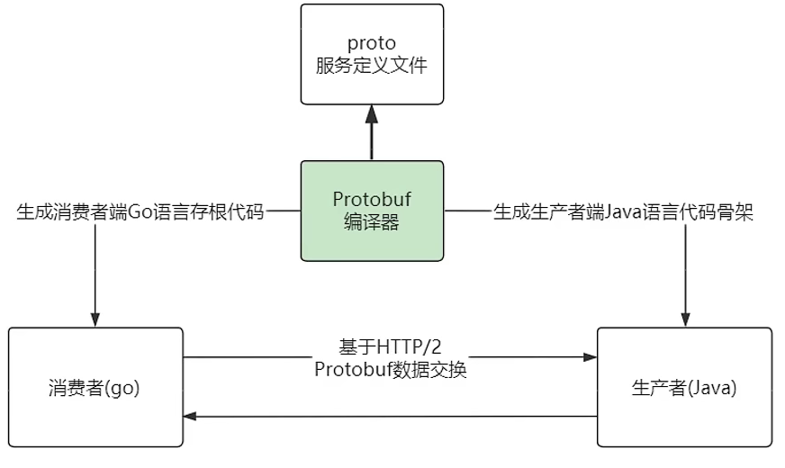
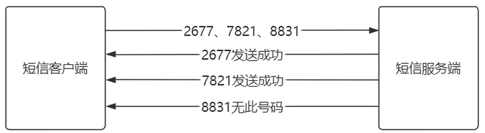
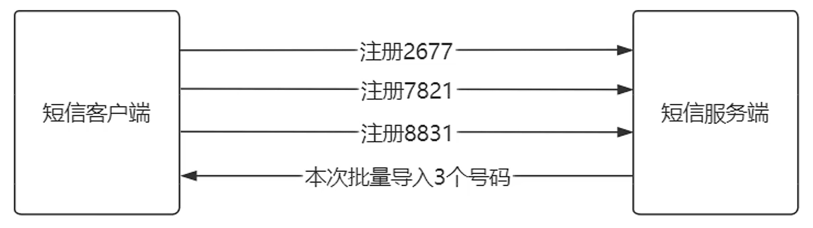

# gRPC通信模式

## 1 一元RPC通信模式

一元RPC通信模式：客户端向服务器发送**单个请求**并获得**单个响应**



> 练手项目news就是这个模式

## 2 服务端流式RPC通信模式

服务端流式RPC通信模式：从客户端发起**单次请求**，会产生从服务器的**多次响应**

> 响应就像流水一样



开发方式：

1. 搭建基础开发架构的方式都不变

2. rpc api接口的返回值类型有`stream`修饰

   ```protobuf
   syntax = 'proto3';
   option java_multiple_files = false;
   option java_package = 'cn.edu.hit.news.proto';
   option java_outer_classname = 'NewsProto';
   package sms;
   service SmsService {
     rpc sendSms(SmsRequest) returns (stream SmsResponse) {}
   }
   message SmsRequest {
     repeated string phoneNumber = 1;
     string content = 2;
   }
   message SmsResponse {
     string result = 1;
   }
   ```

3. 构建多个`response`对象，多次调用`responseObserver.onNext`方法

   - 获取集合类型对象要用`ProtocolStringList`类型接收

   ```java
   public class SmsService extends SmsServiceGrpc.SmsServiceImplBase {
       @Override
       public void sendSms(SmsProto.SmsRequest request, StreamObserver<SmsProto.SmsResponse> responseObserver) {
           ProtocolStringList phoneNumberList = request.getPhoneNumberList();
           phoneNumberList.forEach((phoneNumber) -> {
               SmsProto.SmsResponse response = SmsProto.SmsResponse.newBuilder().setResult(request.getContent() + ',' + phoneNumber + "已发送").build();
               responseObserver.onNext(response);
               try {
                   Thread.sleep(1000);
               } catch (InterruptedException e) {
                   e.printStackTrace();
               }
           });
           responseObserver.onCompleted();
       }
   }
   ```

4. 在Server上增加Service

   ```java
   public class GrpcServer {
       private static final int port = 9999;
       public static void main(String[] args) throws InterruptedException, IOException {
           Server server = ServerBuilder.forPort(port)
                   .addService(new NewsService())
                   .addService(new SmsService())
                   .build().start();
           System.out.println("GRPC服务端启动成功，端口号：" + port);
           server.awaitTermination();
       }
   }
   ```

5. `BlockingStub`同样支持**服务端流式数据通信**

   > 其实本质上grpc对服务端流式返回与一元通信的处理差不多，同步的，都是流式观察者对象调用一次或多次`onNext`传递返回值，再`onCompleted`结束

   - 调用api的返回值不是简单的类型，而是一个**迭代器**，封装了所有的返回值

   ```java
   public class NewsClient2 {
       private static final String host = "localhost";
       private static final int port = 9999;
   
       public static void main(String[] args) {
           ManagedChannel channel = ManagedChannelBuilder.forAddress(host, port).usePlaintext().build();
           try {
               SmsServiceGrpc.SmsServiceBlockingStub smsService = SmsServiceGrpc.newBlockingStub(channel);
               SmsProto.SmsRequest request = SmsProto.SmsRequest.newBuilder()
                       .setContent("下午三点开会")
                       .addPhoneNumber("c9")
                       .addPhoneNumber("985211")
                       .addPhoneNumber("双一流")
                       .addPhoneNumber("工科第二")
                       .addPhoneNumber("国防七子")
                       .addPhoneNumber("实体清单")
                       .build();
               Iterator<SmsProto.SmsResponse> itr = smsService.sendSms(request);
               while (itr.hasNext()) {
                   SmsProto.SmsResponse response = itr.next();
                   System.out.println(response.getResult());
               }
           } finally {
               channel.shutdown();
           }
       }
   }
   ```

## 3 客户端流式RPC通信模式

客户端流式RPC通信模式：从客户端发起不定次请求，产生从服务器的1次响应



> 所以是需要客户端提供一个信号，说明本组请求彻底结束了；
>
> 具体应用场景就是，来一个事件发一个请求，等到最后的某一时刻再批量处
>
> > 其实实际应用并不多

开发方式：

1. 搭建基础开发架构的方式都不变

2. rpc api接口的参数类型有`stream`修饰

   ```protobuf
   rpc createPhone(stream PhoneNumberRequest) returns (PhoneNumberResponse) {}
   ```

3. 服务端对api接口的实现相对复杂，需要采用**异步方式**，基于**事件回调**

   - api接口的返回值上也多了一个流式观察者，它的泛型是**grpc请求类型**，而参数中的那个流式观察者类型是grpc响应类型
   - 要返回一个重写了三个方法的流式观察者对象，其实就是监听三个事件
     - `onNext`：接收到请求
     - `onError`：传输过程发生错误
     - `onCompleted`：全部请求结束时，就是要真正返回数据了

   ```java
   @Override
   public StreamObserver<SmsProto.PhoneNumberRequest> createPhone(StreamObserver<SmsProto.PhoneNumberResponse> responseObserver) {
     return new StreamObserver<>() {
       int i = 0;
       @Override
       public void onNext(SmsProto.PhoneNumberRequest phoneNumberRequest) {
         System.out.println(phoneNumberRequest.getPhoneNumber() + "手机号已登记");
         i++;
       }
   
       @Override
       public void onError(Throwable throwable) {
         throwable.printStackTrace();
       }
   
       @Override
       public void onCompleted() {
         responseObserver.onNext(SmsProto.PhoneNumberResponse.newBuilder().setResult("您本次批量导入" + i + "个员工电话").build());
         responseObserver.onCompleted();
       }
     };
   }
   ```

4. 客户端

   - 需要使用**异步Stub**：`ServiceStub`

     > 用`ServiceGrpc`的`newStub(Channel)`方法创建

   - 需要用Stub创建一个**泛型为grpc请求类型**的**流式观察者对象**，用于发起请求

     > 与之前的方式对比，之前的Stub是直接用来调方法的

     > :star:使用异步Stub的`createXxx`方法创建，同样传入一个**泛型为grpc响应类型**的流式观察者对象，被传入的这个流式观察者对象的职责是**异步处理响应**，创建得到的流式观察者对象的职责是**发送请求**
     >
     > > **泛型为grpc响应类型**的流式观察者怎么创建？参考服务端那边的创建方法，但服务端用这个方法创建的是泛型为grpc请求类型的哦，注意区分
     > >
     > > - `onNext`回调会在服务端响应时执行
     >
     > > 为什么创建泛型为请求类型的，还需要传入泛型为响应类型的？因为对于一个异步请求，要知道提前它怎样处理响应啊，就和AJAX差不多，传入一个处理响应的回调

   - 创建多个grpc请求对象，传入流式观察者对象的`onNext`方法，从而发送请求给服务器

   - 所有请求发送完毕后，调用流式观察者对象的`onCompleted`方法

## 4 双向流式RPC通信模式

1. 搭建基础开发架构的方式都不变

2. rpc api接口的返回值和参数类型都有`stream`修饰

   ```java
   rpc createAndSendSms(stream PhoneNumberRequest) returns (stream PhoneNumberResponse) {}
   ```

   > 也就是相当于将两个单向流式结合起来了，还是以**异步**为主，本质上和客户端流式通信差不多

3. 服务端同样采用异步方式，定义回调函数即可

   ```java
   @Override
   public StreamObserver<SmsProto.PhoneNumberRequest> createAndSendSms(StreamObserver<SmsProto.PhoneNumberResponse> responseObserver) {
     return new StreamObserver<>() {
       int i = 0;
   
       @Override
       public void onNext(SmsProto.PhoneNumberRequest phoneNumberRequest) {
         System.out.println(phoneNumberRequest.getPhoneNumber() + "手机号已登记");
         responseObserver.onNext(SmsProto.PhoneNumberResponse.newBuilder().setResult(phoneNumberRequest.getPhoneNumber() + ",已经发送给部门经理").build());
         responseObserver.onNext(SmsProto.PhoneNumberResponse.newBuilder().setResult(phoneNumberRequest.getPhoneNumber() + ",已经发送给副总经理").build());
         responseObserver.onNext(SmsProto.PhoneNumberResponse.newBuilder().setResult(phoneNumberRequest.getPhoneNumber() + ",已经发送给总经理").build());
       }
   
       @Override
       public void onError(Throwable throwable) {
         throwable.printStackTrace();
       }
   
       @Override
       public void onCompleted() {
         responseObserver.onCompleted();
       }
     };
   }
   ```

4. 客户端也同理，发起请求同时给定响应的回调，改个方法名而已，其他的与3一模一样

   


